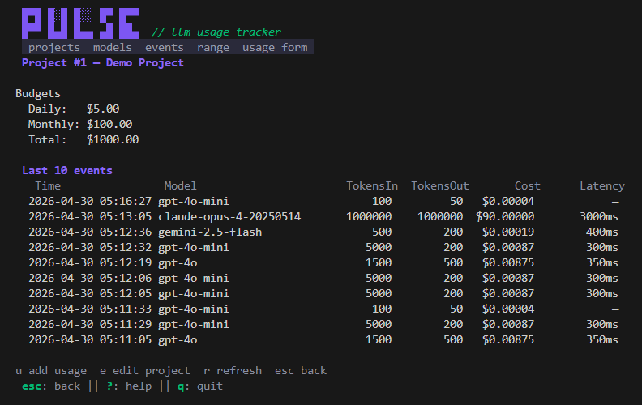
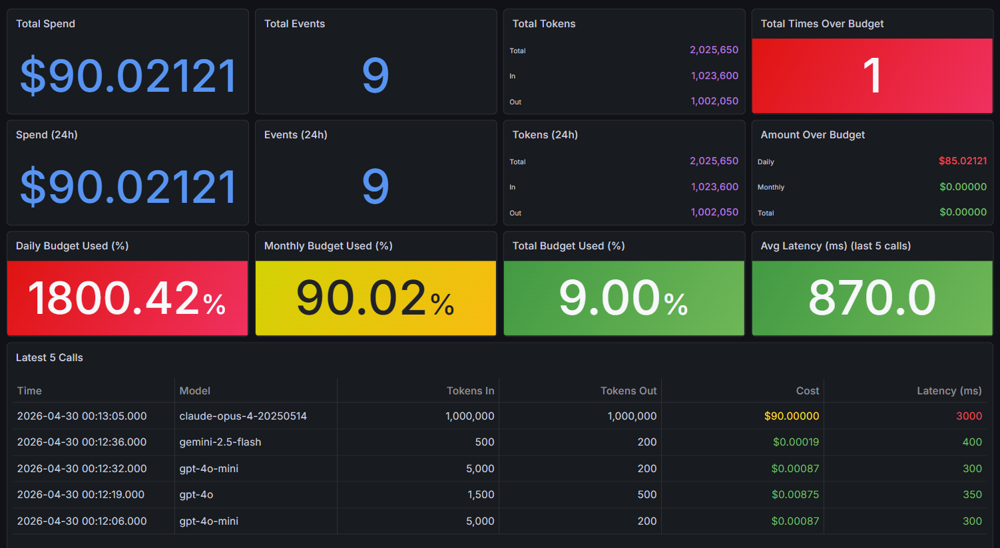
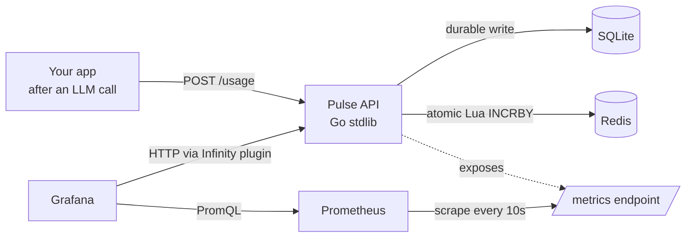

<div align="center">

# ⚡ Pulse

**Real-time LLM usage and budget tracker with auto-provisioned Grafana dashboards.**

[](go.mod)
[](docker-compose.yml)
[](prometheus.yml)
[](grafana/dashboards/pulse-overview.json)
[](LICENSE)

<table>
  <tr>
    <td width="50%"></td>
    <td width="50%"></td>
  </tr>
  <tr>
    <td align="center"><sub>Terminal UI — projects, models, events, ad-hoc usage entry</sub></td>
    <td align="center"><sub>Auto-provisioned Grafana dashboard</sub></td>
  </tr>
</table>

</div>

## Why Pulse?

At my internship, we use shared company API keys across multiple devs. The problem? You either don't have access to the billing dashboard, the default dashboards (like OpenAI's) are clunky, or you simply can't isolate your usage from everyone else's.

I built Pulse to solve this. It's a lightweight, self-hosted tracker for anyone who wants clear visibility into their own LLM spend and latency. POST a usage event, get back your budget status, and view it in real-time on Grafana. I plan to expand this to support team tracking and AI-assisted IDEs in the future.

## Features

- **Per-project daily, monthly, and total budgets** with warn-only enforcement (your LLM call already happened, so blocking is pointless).
- **Atomic budget checks via Lua** running inside Redis. One round-trip increments three counters and returns over/under flags.
- **Cost computed server-side** from a model pricing table you control. Clients pass tokens, server multiplies. Stored as millicents to avoid integer-truncation errors on cheap models.
- **Aggregations** over any date range or RFC3339 timestamp window. Per-project, per-model, or all-projects rollup.
- **Cursor-paginated event listings** for raw event history.
- **Auto-provisioned Grafana dashboard** with project selector, budget gauges, latest-calls table. Boots ready-to-use on `docker compose up`.
- **Prometheus metrics** for HTTP, cache, business events. Scrape with anything.
- **No external services**. SQLite + Redis + your binary. Run it on your machine or anywhere!

## Quick start

**1. Bring up the stack**

```bash
git clone https://github.com/baohuy1303/llm-usage-tracker.git
cd llm-usage-tracker
docker compose up --build
```

Four containers come up:

| Service | URL | What |
|---------|-----|------|
| Pulse API | http://localhost:8080 | The Go HTTP server |
| Prometheus | http://localhost:9090 | Metrics storage |
| Grafana | http://localhost:3000 | Dashboards (admin / admin) |
| Redis | (internal) | Counter cache |

**2. Launch the TUI**

```bash
go build -o pulse-tui ./cmd/tui
./pulse-tui
```

The TUI is the primary way to drive Pulse day-to-day. Tabs across the top cycle through **projects, models, events, range queries, and manual usage entry** — create projects with budgets, add models with pricing, browse events, and log ad-hoc LLM calls without touching curl. Press `?` for keybinds, `q` to quit. Reads `BASE_URL` from env (defaults to `http://localhost:8080`).

**3. Open the dashboard**

Open Grafana → **Dashboards** → **Pulse Overview**, then pick a project from the dropdown.

## Architecture



SQL is the source of truth. Redis caches per-day and per-month counters for fast budget reads. Prometheus stores time-series for dashboards. The dashboard hits Prometheus for aggregates and your API directly for event-level lists.

## Configuration

All optional. Defaults work for `docker compose up`.

| Variable | Default | Purpose |
|----------|---------|---------|
| `DATABASE_URL` | `./data/app.db` (`/data/app.db` in container) | SQLite path. |
| `REDIS_ADDR` | `localhost:6379` (`redis:6379` in container) | Redis host:port. App degrades gracefully if Redis is unreachable; budget enforcement disabled. |
| `LOG_LEVEL` | `info` | Set to `debug` to see cache hit/miss logs and Lua script outcomes. |

## Tech stack

| Layer | Library |
|-------|---------|
| HTTP | Go 1.26+ stdlib `net/http` (no framework) |
| DB | [`modernc.org/sqlite`](https://pkg.go.dev/modernc.org/sqlite) (pure-Go SQLite, no CGO) |
| Cache | [`go-redis/v9`](https://github.com/redis/go-redis) |
| Metrics | [`prometheus/client_golang`](https://github.com/prometheus/client_golang) |
| Logging | `log/slog` (stdlib) |
| Env | [`joho/godotenv`](https://github.com/joho/godotenv) |
| Container | Multi-stage Dockerfile, ~15 MB final image |

## Development

```bash
# Run locally without Docker
go run ./cmd/api

# Run tests
go test ./...

# Wipe everything and start fresh
docker compose down -v
redis-cli FLUSHDB        # only if you also kept Redis from a prior run
```

When the SQL schema changes, delete `./data/app.db` so the new migration applies on next start.

When the Lua script changes the shape of a Redis key (e.g. tokens key changing from string to hash), `redis-cli FLUSHDB` to avoid `WRONGTYPE` errors against keys with the old shape.

### HTTP API (optional)

The TUI covers everything you need interactively. If you want to script Pulse or wire it into another service, the raw HTTP API is documented in [`api.md`](api.md), with ready-to-run requests in [`api.http`](api.http) (top-9 endpoints under a `QUICKSTART` heading; open in VS Code with the REST Client extension or any JetBrains IDE).

## Roadmap
- [x] Terminal UI for the compact dev tools experience
- [ ] Auth on `/metrics` and the public API surface
- [ ] OpenTelemetry tracing on the request path
- [ ] Server-sent events for live dashboard streaming (skip Grafana refresh delay)
- [ ] SDK for Go and Python so devs don't have to roll their own POST wrapper

## My notes

It's a fun little project where I try to learn and implement many golang and new techs. I would like to expand this project to support team tracking and AI-assisted IDEs in the future.

Feel free to reach out, I'm more than happy to chat!
